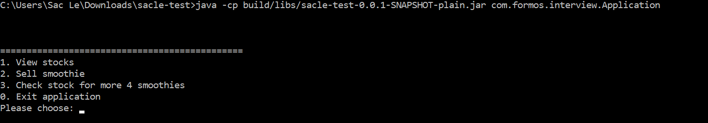
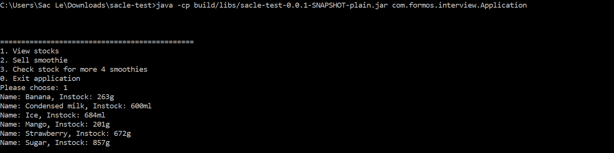
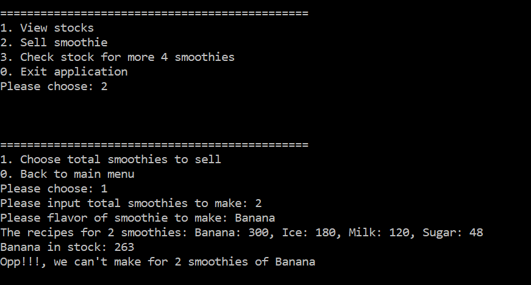
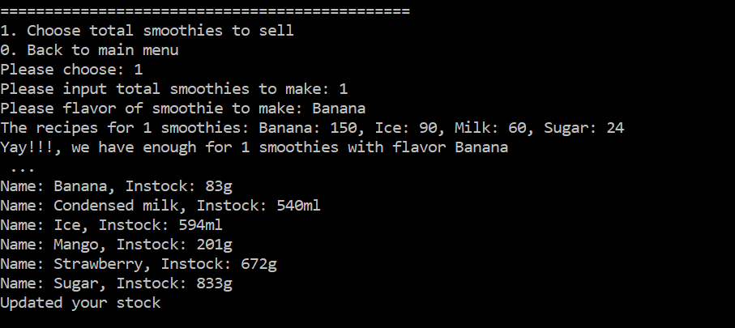

## Formos Interview

### Run bellow command to run project

`./gradlew Jar`
* run jar file by `java -cp sacle-test-0.0.1-SNAPSHOT-plain.jar com.formos.interview.Application`
* or `java -cp build/libs/sacle-test-0.0.1-SNAPSHOT-plain.jar com.formos.interview.Application`

